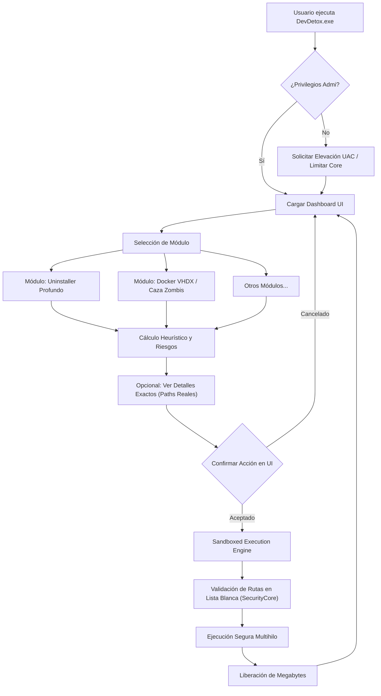

# DevDetox 🧹🛡️

[](https://www.python.org/downloads/)
[](https://opensource.org/licenses/MIT)
[](https://github.com/TomSchimansky/CustomTkinter)

**DevDetox** es la suite definitiva de limpieza y optimización para el sistema operativo Windows, diseñada específicamente para entornos de desarrollo y programadores. 

A diferencia de los limpiadores genéricos comerciales, DevDetox entiende la estructura de herramientas complejas como Docker, npm, Node.js, SDKs de Android, telemetría de IAs y editores de código. Permite auditar y recuperar gigabytes de almacenamiento con precisión quirúrgica, blindando tu entorno local nativo.

 *(Nota: Sustituir con tu propia captura de pantalla)*

---

## ✨ Características Principales

* 🧟‍♂️ **Caza Zombis de Node (`node_modules`):** Rastrea recursivamente tu disco duro en busca de proyectos abandonados por meses y aniquila las pesadas carpetas `node_modules` inactivas.
* 📦 **Gestor de Caché Global (NPM / PNPM):** Vacía las inmensas cachés residuales que los gestores de paquetes JavaScript acumulan silenciosamente.
* 🐳 **Compactador VHDX de Docker:** Obliga a WSL2 (Windows Subsystem for Linux) a realizar un apagado en seco y utiliza *diskpart* para defragmentar y encoger el disco virtual de Docker (ext4.vhdx) a su tamaño real.
* 💻 **Bajo Nivel y Editores (VS Code, Cursor, Trae):** Purga Crashpads, Workspace Storage, Extensiones oxidadas de VSCode y Cachés ocultas de SDKs (Android AVD, Gradle) y logs de IA (Gemini, Cursor Telemetry).
* 🌍 **Explorador Multiperfil de Navegadores:** Vacía la caché acelerada de datos, ShaderCache y GPU Cache de Chrome, Edge, Brave y Firefox de manera paralela sin destruir las contraseñas guardadas ni las cookies de sesión activa.
* 🔪 **Desinstalador Profundo Heurístico:** Lee la tabla real de software de la base de registros de Windows (WMI), permitiéndote desinstalar programas (MSI/EXE) aplicando filtros interactivos (A-Z, más pesados, fecha de instalación), seguido de de un escuadrón de limpieza que rastrea dependencias huérfanas en `%AppData%` y `ProgramData`.

---

## 🚀 Guía de Instalación Local

Para clonar e iniciar DevDetox en modo desarrollo desde tu máquina local, sigue estos pasos:

### Requisitos Previos
* **OS:** Windows 10 / Windows 11
* **Python:** Versión `3.11` o superior instalada en el PATH del sistema.

### 1. Clonar el Repositorio
Abre tu terminal (PowerShell / Git Bash) y ejecuta:
```bash
git clone https://github.com/TU_USUARIO/DevDetox.git
cd DevDetox
```

### 2. Entorno Virtual y Dependencias
Se recomienda establecer un entorno virtual para no contaminar tu Python global:
```bash
python -m venv venv
.\venv\Scripts\Activate.ps1
```

Instala las librerías fundamentales usando el archivo de requerimientos de este repositorio:
```bash
pip install -r requirements.txt
```

### 3. Ejecutar la Aplicación en Modo Dev
Dado que DevDetox usa llamadas privilegiadas (leer el registro local para el Desinstalador), te pedirá elevación UAC en caso de requerirla.
```bash
python src/main.py
```

---

## 📦 Compilación a Archivo Ejecutable (.exe)

Si deseas compartir tu herramienta o usarla estáticamente sin depender de una consola de Python abierta, DevDetox incluye soporte nativo y un comando para compilar su código a un único archivo binario haciendo uso de **PyInstaller**.

1. Asegúrate de tener PyInstaller instalado global o localmente:
   ```bash
   pip install pyinstaller
   ```
2. Ejecuta la compilación con enlazado estático de la librería CustomTkinter:
   ```bash
   pyinstaller --noconfirm --onefile --windowed --name "DevDetox" --add-data "C:\ruta\hacia\tu\python\site-packages\customtkinter;customtkinter/" src\main.py
   ```
   *(Asegúrate de cambiar la ruta de `--add-data` a la ruta física donde está instalada tu librería de customtkinter).*
3. Obtendrás tu ejecutable nativo libre de dependencias dentro de la carpeta `/dist/DevDetox.exe`.

---

## 🏗️ Estructura del Proyecto

```
DevDetox/
├── docs/                   # Documentación profunda para cada módulo (exigida en PRs)
├── src/
│   ├── main.py             # Entrada principal, chequeos UAC Administrator
│   ├── core/               # Motores abstractos (CmdEngine, SecurityCore)
│   ├── gui/                # Clases de Interfaz en CustomTkinter (app.py)
│   └── modules/            # Scripts aislados de purga (Cleaners)
│       ├── browsers_cleaner.py
│       ├── deep_uninstaller.py
│       ├── docker_cleaner.py
│       ├── editors_cleaner.py
│       ├── node_zombie_hunter.py
│       ├── npm_cleaner.py
│       ├── sdks_ia_cleaner.py
│       └── windows_core_cleaner.py
├── .gitignore
├── README.md
```

---

## 🔒 Arquitectura de Seguridad y Transparencia

DevDetox opera bajo una arquitectura altamente modular y desacoplada, estableciendo "Sandboxes" de seguridad inquebrantables.

### Escudos Activos (Zero-Bricking):
1. **White-listing Estricto:** Es imposible corromper el hardware. Ningún módulo acepta imputs del usuario que permitan Path Traversal (ej. `../../Windows/System32`). Todas las rutas se resuelven validando semánticamente `os.environ`.
2. **Modal Safeguard Visual:** Todos los módulos cuentan con un botón "Ver Detalles" incrustado en su base que intercepta, enumera y extrae las rutas literales que serán borradas antes de ejecutar la purga. El usuario toma decisiones basadas en metadatos.



---

## 🤝 Contribuciones
¡Las Pull Requests son bienvenidas! Todo nuevo "Cleaner" o módulo debe heredar los principios de cero asunción de riesgos y documentar exhaustivamente su accionar en la carpeta `/docs`.

## � Licencia
Este proyecto se encuentra bajo los términos de la licencia MIT. Abierto y libre para el uso personal y profesional de toda la comunidad de desarrolladores.
